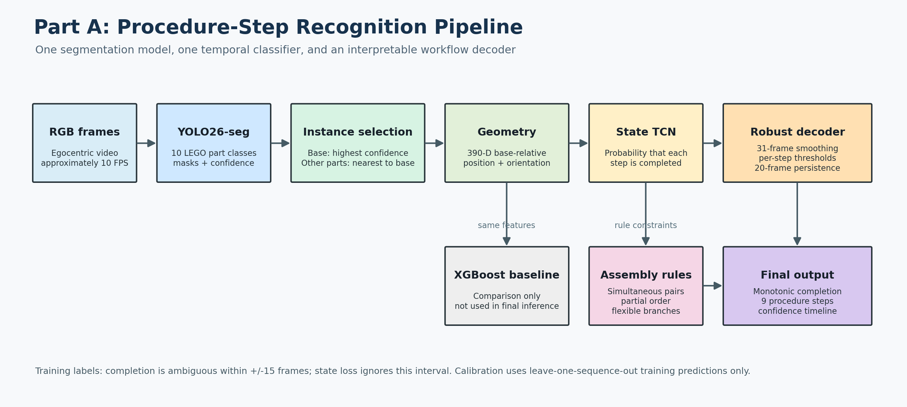
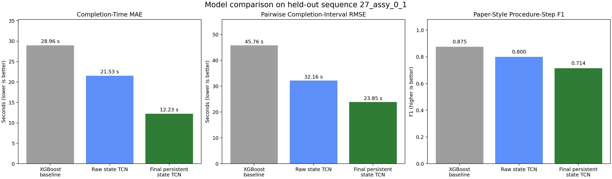

# Part A: Procedure Step and Workflow-State Estimation

This folder is the complete Part A deliverable for the MANUFACTOR technical
assignment. It contains the implemented RGB pipeline, trained checkpoints,
features, evaluation code, metrics, diagrams.



## Problem

The system recognizes completion of nine LEGO-car assembly steps from
egocentric RGB video. `PSR_labels.csv` contains sparse completion frames, but
the exact frame may be blurred, occluded, or delayed. The model therefore
considers the `+/-15`-frame interval during state training.

The CSV values are PSR label codes, not step numbers:

| Procedure step | Operation | PSR code |
|---:|---|---:|
| 1 | Install front chassis | `3` |
| 2 | Install front chassis pin | `6` |
| 3 | Install rear chassis variant | `9` or `12` |
| 4 | Install front-rear chassis pin | `15` |
| 5 | Install rear-rear chassis pin | `18` |
| 6 | Install front bracket | `21` |
| 7 | Install front bracket screw | `24` |
| 8 | Install front wheel assembly | `27` |
| 9 | Install rear wheel assembly | `30` |

Steps 1+2 and 6+7 always share completion frames, so seven observable event
groups represent all nine procedure steps.

## Final Pipeline

1. One YOLO26 segmentation model detects 10 LEGO part classes.
2. The highest-confidence base is selected. For every other class, the
   detection nearest the base is used, reducing confusion from loose parts.
3. Each frame becomes a 390-D vector containing presence, confidence, mask
   geometry, orientation, and base-relative/pairwise relationships.
4. One state TCN estimates whether each event is incomplete or complete.
5. A 31-frame smoother reduces frame-level probability noise.
6. Per-event thresholds are calibrated from leave-one-sequence-out training
   predictions only.
7. A 20-frame persistence test with `0.15` hysteresis rejects short spikes.
8. Completion becomes monotonic once accepted.
9. Assembly rules enforce simultaneous pairs and the observed partial order
   while retaining flexible branches.

XGBoost is included only as a low-data comparison baseline. The retired
direct-event TCN and two-TCN ensemble are not part of final inference.

Rules are documented in [config/assembly_rules.json](config/assembly_rules.json).

## Validation

- YOLO validation uses temporal blocks from the annotated recording.
- PSR validation uses leave-one-sequence-out splits across the four training
  recordings, never random neighboring frames.
- Thresholds, smoothing, and persistence are selected from out-of-fold
  training predictions.
- Sequence `27_assy_0_1` is used only for final diagnostic evaluation.

## Results

### YOLO segmentation

| Metric | Result |
|---|---:|
| Mask mAP@50 | `0.851` |
| Mask mAP@50-95 | `0.629` |
| Box mAP@50 | `0.840` |
| Box mAP@50-95 | `0.689` |

### Final completion evaluation

| Metric | Result |
|---|---:|
| Completion-Time MAE | `12.23 seconds` |
| Pairwise Completion-Interval RMSE | `23.85 seconds` |
| Paper-style procedure-step F1 | `0.714` |

Comparison on the held-out sequence:

| Model | Completion-Time MAE | Pairwise Interval RMSE | Paper-style F1 |
|---|---:|---:|---:|
| XGBoost baseline | `28.96 s` | `45.76 s` | **`0.875`** |
| Raw state TCN | `21.53 s` | `32.16 s` | `0.800` |
| Final persistent state TCN | **`12.23 s`** | **`23.85 s`** | `0.714` |

**Completion-Time MAE** is the average absolute difference between each
predicted completion time and its ground-truth completion time.

**Pairwise Completion-Interval RMSE** compares all 21 time gaps among the
seven event groups. For every event pair, the predicted time gap is compared
with the real time gap. The differences are squared, averaged, and
square-rooted. This measures whether the model preserves the temporal spacing
of the workflow, even when individual events are shifted.

**Paper-style procedure-step F1** follows the IndustReal evaluation: an
on-time or late recognition is a true positive, a premature recognition is a
false positive, and a completed step that is never recognized is a false
negative. Steps 1+2 and 6+7 each contribute two procedure-step decisions. The
final pipeline has `5 TP`, `4 FP`, and `0 FN`, giving precision `0.556`,
recall `1.000`, and F1 `0.714`.

Lower is better for MAE and RMSE; higher is better for F1. XGBoost obtains the
highest F1 because its large errors are mainly late predictions, which F1
still counts as true positives. The final pipeline has substantially better
timing but four premature procedure-step decisions, reducing its F1.

The full calculations are stored in `results/final_evaluation/`.



The full timeline is [figures/timeline.png](figures/timeline.png), and numeric
results are in
[results/final_evaluation/metrics.json](results/final_evaluation/metrics.json).

## Limitations

- Only four independent PSR training recordings are available.
- Loose and installed parts can still have similar geometry.
- The rear-chassis variants for PSR codes `9` and `12` are not visually
  separated by the detector.
- Individual completion times and the spacing between events remain
  inaccurate for some early assembly states.
- The prototype is not suitable for safety decisions or punitive operator
  assessment.


## Interactive Demo

Launch the video-upload interface:

```powershell
.\run_demo.cmd
```

The Gradio app provides a live YOLO preview, final annotated video, object
counts, step-completion timestamps, inferred interval durations, and detailed
logs. The canonical `27_assy_0_1` test video uses the packaged probabilities
behind the published timeline so its completion results remain reproducible.
See [DEMO.md](DEMO.md).

## Reproduce Evaluation

From `part_A`:

```powershell
.\run_evaluation.cmd
```

The packaged labels and saved probabilities are sufficient. To repeat feature
extraction from original RGB frames, point `PSR_DATA_ROOT` at the dataset root:

```powershell
$env:PSR_DATA_ROOT = ".."
python .\scripts\extract_yolo_geometry.py --overwrite
```

## References

- Schoonbeek, T. J. (2024). *IndustReal: A Dataset for Procedure Step
  Recognition Handling Execution Errors in Egocentric Videos in an
  Industrial-Like Setting*. WACV 2024.
- Ultralytics segmentation documentation:
  https://docs.ultralytics.com/tasks/segment/
- XGBoost documentation: https://xgboost.readthedocs.io/
